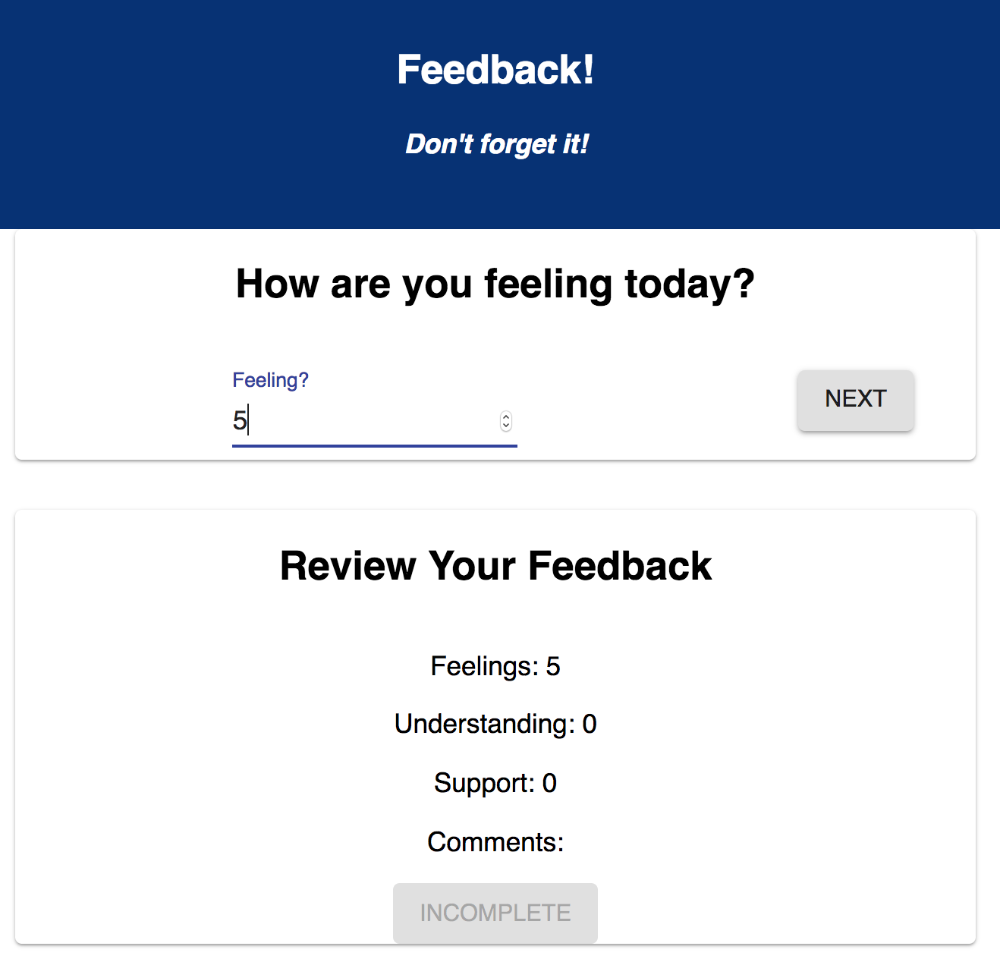
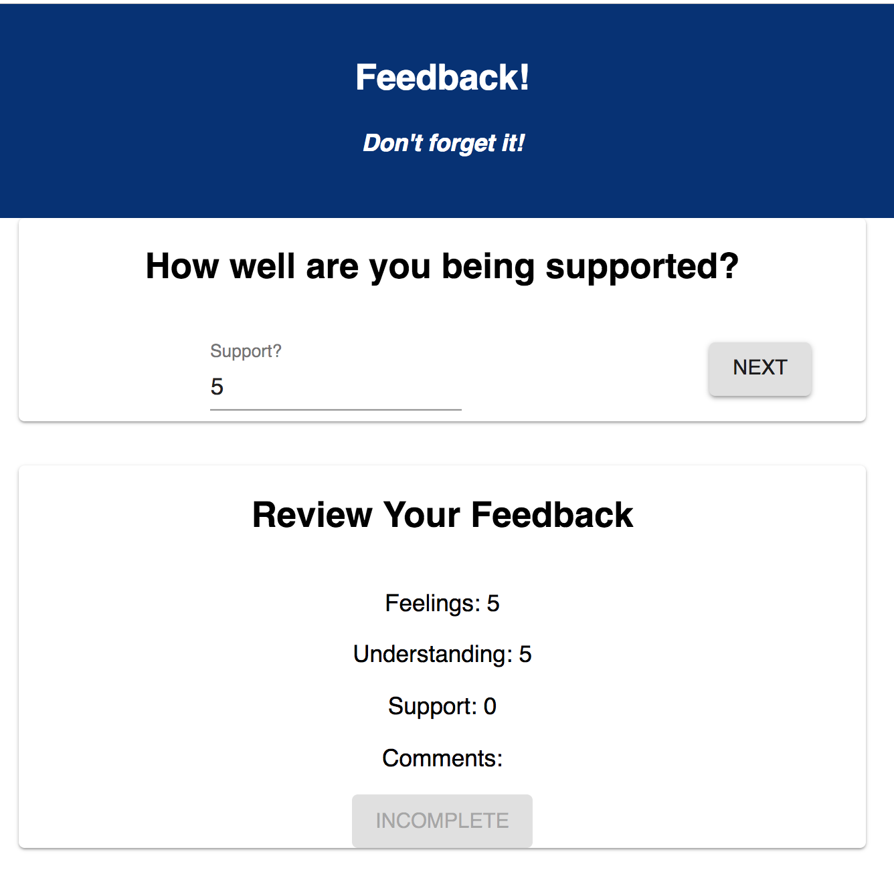

# Redux Feedback Loop


 This application is a feedback form modeled after Prime's system. Feedback will be collected over 4 views, and when all steps are complete, your app will save the feedback in the database. In a separate part of the page, display the current feedback values and a submit button. 

### SETUP

Create your database and tables using the provided `data.sql` file. Start the server.

```
npm install
npm run server
```

Now that the server is running, open a new terminal tab with `cmd + t` and start the react client app.

```
npm run client
```

### ADD NEW FEEDBACK
 
There will be 4 views for the form parts.
The parts:
- How are you feeling today?

- How well are you understanding the content?

- How well are you being supported?

- Any comments you want to leave?


## THE REVIEW COMPONENT

### Incomplete, Submit button is disabled:


### Survey complete, Submit button is active:


## SUBMIT THE FEEDBACK


### ADMIN SECTION


### Author
Sharmarke Duale
